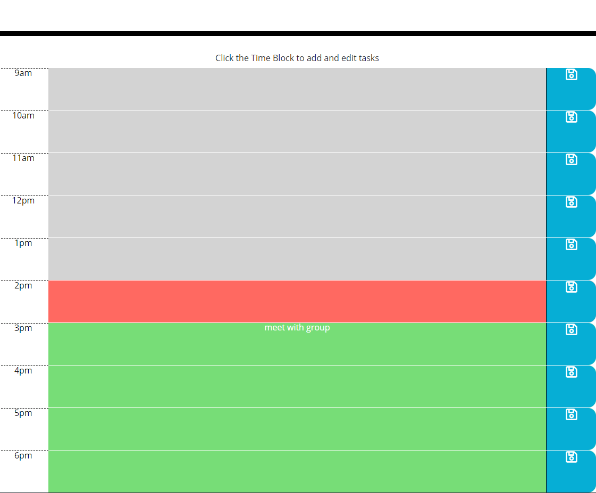

# Work Day Scheduler

## Styling using Bootstrap

using the front end framework bootstrap, i was able to a quick layout of the daily scheduler and set up the containers for each of the sections.

## Jquery and momentjs

using this front end javascript library, I was able to add basic functionality of this app in little to no time. I also used the moment.js library in order to add time functionality to app in regards to active time and due dates.

moment.js was also used to djisplay the current date at the tpo of the webpage.

[Work Day Scheduler](https://dorvilsteven.github.io/work-day-scheduler/)
